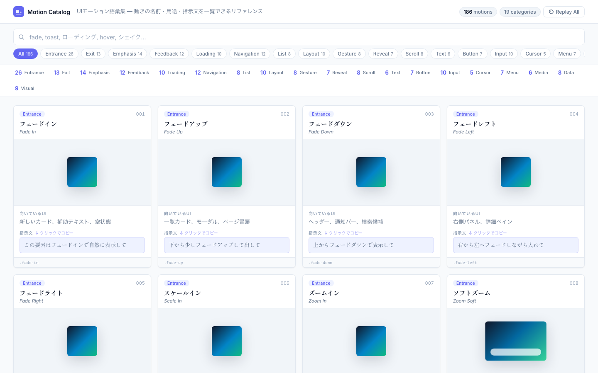

# Motion Catalog

**A searchable vocabulary of UI motion.** 600 two-dimensional UI patterns plus 50 interactive WebGL / Three.js scenes — each with a name, a live preview, timing specs, a ready-to-paste request prompt, and one-click copyable code. The 2D catalog contains 371 original patterns plus the complete vocabularies of Animate.css, Hover.css, SpinKit, and CSShake under their official class names.

   

**[Live demo →](https://izumuzui.github.io/motion-catalog/)**



## Why

"Make it feel smoother" is not a spec. Designers, developers, and AI coding tools all work better with a shared, precise motion vocabulary — *"use a spring-in entrance"*, *"add a destructive-step confirm"*, *"stagger the list items"*.

Motion Catalog gives every common UI motion a name you can point at.

## What each card gives you

| | |
| --- | --- |
| **Live preview** | HTML/CSS for 2D; interactive WebGL for 3D. Every card is replayable |
| **Timing spec** | `duration · easing · iterations`; measured from CSS or declared by the 3D scene |
| **Use cases** | Where the pattern fits (buttons, toasts, lists, charts…) |
| **Request prompt** | A one-line instruction (Japanese) to hand to a designer or an AI tool — click to copy |
| **Copy code** | Extracts CSS + `@keyframes`, or copies a runnable Three.js starter snippet |

## Features

- **Search** — instant filtering by name, Japanese name, use case, or class name, with `/` or `⌘K` to focus, and shareable URLs (`?q=…&target=…&cat=…`)
- **Two-axis filtering** — by target component (button, form, overlay, toast…) and by motion type (Entrance, Exit, Feedback, Loading…)
- **Contextual previews** — generic motions re-render on the component you selected (pick *Button* and entrances animate a button, not an abstract box)
- **Playback speed** — inspect any motion at 0.5× / 1× / 2×
- **Light & dark themes** — follows `prefers-color-scheme`, one-click toggle
- **Reduced motion** — respects `prefers-reduced-motion`, with an explicit opt-in override
- **Performance** — off-screen previews are paused via `IntersectionObserver`
- **One WebGL renderer** — all visible 3D cards share one scissored renderer, avoiding per-card context limits
- **Interactive 3D stages** — drag a scene to orbit it, or use arrow keys while the stage is focused

## Getting started

It's a fully static site — no build step and no framework. Three.js r184 is loaded as an ES module from jsDelivr; the CSS libraries are vendored.

```sh
git clone https://github.com/izumuzui/motion-catalog.git
cd motion-catalog
python3 -m http.server 4177   # or any static server
# open http://localhost:4177/
```

## Categories

Entrance · Exit · Emphasis · Feedback · Loading · Navigation · List · Layout · Gesture · Reveal · Scroll · Text · Button · Input · Cursor · Menu · Media · Data · Visual · Hover

3D: Transform · Camera · Lighting · Material · Particles · Geometry · Spatial UI · Physics

## What's inside

| Source | Patterns | Notes |
| --- | --- | --- |
| **Original** | 371 | Component-level motions: buttons, inputs, lists, charts, loaders, navigation, text, visual effects |
| [Animate.css](https://animate.style/) v4.1.1 | 97 | The classic entrance / exit / attention set, under official `animate__*` class names |
| [Hover.css](https://ianlunn.github.io/Hover/) v2.3.2 | 110 | Hover transitions (`hvr-*`), auto-played in previews |
| [SpinKit](https://tobiasahlin.com/spinkit/) v2.0.1 | 12 | Loading spinners (`sk-*`) |
| [CSShake](https://elrumordelaluz.github.io/csshake/) v1.7.0 | 10 | Shake variants (`shake-*`) |
| [Three.js](https://threejs.org/) r184 | 50 | Interactive WebGL scenes using a shared renderer |

Vendored libraries live in [`vendor/`](vendor/) unmodified except a marked preview-autoplay shim in `hover.css`; all are MIT licensed by their respective authors.

## Project layout

```
index.html   structure and markup
tokens.css   shared UI and 3D design tokens
styles.css   design system + original 2D previews and keyframes
app.js       2D/3D data, rendering, search, filtering, code copy
three-catalog.js  shared Three.js renderer and 50 live scenes
vendor/      Animate.css, Hover.css, SpinKit, CSShake (MIT)
```

## Contributing

New motions are welcome! A motion is one data row in `app.js` plus a preview shape / keyframes in `styles.css`:

1. Add a row to `motions` in `app.js`: `[name, jpName, category, useFor, request, className, previewType]`
2. Add `.your-class { animation: … }` (and `@keyframes`) to `styles.css` — reuse an existing preview type where possible
3. Open `index.html` and confirm the card renders, animates, and its CSS copies cleanly

For 3D motions, add metadata to `THREE_MOTION_ROWS` in `app.js`, then add the scene behavior to the matching builder in `three-catalog.js`. Keep previews on the shared renderer rather than creating a renderer per card.

Bug reports and ideas via [issues](https://github.com/izumuzui/motion-catalog/issues).

## License

[MIT](LICENSE)

---

## 日本語

**UIモーションの語彙集。** 2Dモーション600種類と、Three.js / WebGLによるインタラクティブな3Dモーション50種類を収録しています。すべてに「名前・用途・指示文・ライブプレビュー・コピーできるコード」を付けています。2D側はオリジナル371種に加え、Animate.css / Hover.css / SpinKit / CSShake の全パターンを公式クラス名のまま収録しています。

「なめらかにして」ではなく「**スプリングインで出して**」「**削除は破壊的ステップにして**」と、正確な語彙で依頼できるようにします。デザイナーへの依頼にも、AIコーディングツールへの指示にもそのまま使えます。

- カードの**指示文をクリック**するとコピーできます
- **`.class` ボタン**で実際のCSS(クラス+キーフレーム)をコピーできます
- 3Dカードの **`THREE.JS` ボタン**で実装スニペットをコピーできます
- 3Dプレビューはドラッグ、またはフォーカス後の矢印キーで視点を動かせます
- 検索は `/` キーでフォーカス。絞り込み状態はURLに反映されるので共有できます
- 再生速度切替(0.5×/1×/2×)、ライト/ダークテーマ、`prefers-reduced-motion` 対応
